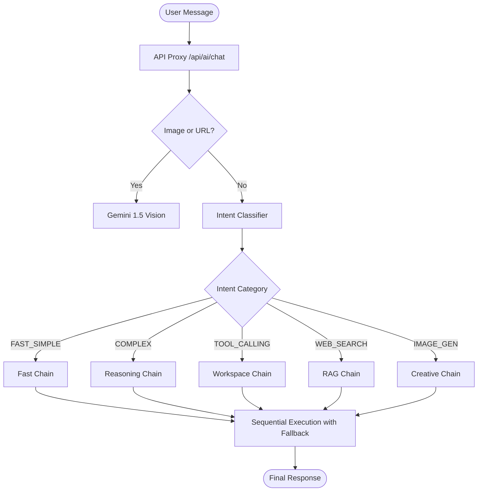

# Flowr AI Agent Workflow Overview (v1.7)

This document describes the internal logic, routing mechanisms, and model selection strategy of the Flowr AI agent.

## 1. High-Level Pipeline
The Flowr AI agent operates as an **Intent-Based Switching Matrix**. Instead of using a single large model for everything, it classifies the user's request and routes it through a prioritized "chain" of models optimized for that specific task.

---

## 2. Phase-by-Phase Logic

### Phase 1: Entry & Vision Pre-Check
- **Location**: `src/lib/bot/chainRouter.ts`
- **Logic**: Before classification, the system checks for binary image data or URLs pointing to images.
- **Action**: If detected, it bypasses standard routing and uses `gemini-1.5-flash-latest` to analyze the visual context.

### Phase 2: Intent Classification
- **Location**: `src/lib/bot/classifier.ts`
- **Logic**: Uses a two-tier approach:
    1. **Keyword Overrides**: Fast-track detection for obvious commands (e.g., "draw", "search", "/").
    2. **LLM Classification**: Uses a configurable model (defaults to `gemini-1.5-flash-lite`) to map the message to one of 6 intent categories based on a specialized system prompt.
- **Configurability**: The classification model ID is sent from the client and can be changed in the store via `setAIClassificationModelId`.

### Phase 3: Dynamic Chain Retrieval
- **Location**: `src/lib/router-config.ts`
- **Logic**: Fetches the model chain from Supabase (`router_chains` table).
- **Fallback**: If the database is unreachable or the chain is empty, it uses the local defaults defined in `src/data/store.constants.ts`.

### Phase 4: Sequential Execution & Failover
- **Location**: `src/lib/bot/chainRouter.ts`
- **Logic**: Iterates through the model list in order of priority.
- **Failover**: If a model returns an error (e.g., 429 Rate Limit, 500 Server Error), the system automatically catches the exception and moves to the next model in the chain within milliseconds.

---

## 3. Model Routing Matrix (v1.7)

| Category | Primary Model | Fallback(s) | Primary Purpose |
| :--- | :--- | :--- | :--- |
| **TOOL_CALLING** | `gemini-2.5-flash` | `llama-3.3-70b` | Note/Folder/Task management via tools. |
| **WEB_SEARCH** | `google-search-grounding` | `tavily-search` | Real-time news and factual queries. |
| **COMPLEX** | `llama-3.3-70b-versatile` | `gemini-3-flash` | Coding, strategy, and deep reasoning. |
| **MEDIUM** | `gemini-3.1-flash-lite` | `llama-3.3-70b` | General chat and balanced tasks. |
| **FAST** | `gemini-3.1-flash-lite` | `llama-3.1-8b` | Greetings and simple questions. |
| **IMAGE_GEN** | `cloudflare-workers-ai` | `imagen-4-ultra` | Image generation and creative output. |
| **AUDIO_VOICE** | `gemini-3-flash-live` | `whisper-large-v3` | Transcription and native voice dialog. |

---

## 4. Provider & Quota Management
The system is designed to maximize free-tier availability while ensuring reliability:

- **Google AI Studio**: Primary for fast classification and search grounding.
- **Groq**: Primary for high-reasoning (Llama 70B) due to extreme speed and high RPD limits.
- **Cloudflare**: Dedicated for creative generation to avoid LLM tokens for binary tasks.
- **Pollinations**: Final "safety net" fallback for image generation.

---

## 5. Metadata & UI Feedback
Every response returned to the client includes:
- `model`: The specific model ID that successfully answered.
- `usage_type`: The category used (displayed in the UI as a tag).
- `content`: The final text or base64 image string.
