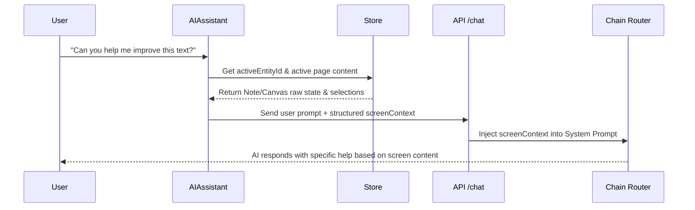

# Brainstorming: Screen Context Awareness for Flowr AI

Implementing **Screen Context Awareness** will allow the Flowr AI assistant to see, understand, and interact directly with what is currently open on the user's screen (e.g., Note pages, Canvas blocks, or active selections). 

Here is the proposed architectural blueprint for this feature.

---

## 🛠️ Architectural Blueprint

### 1. Frontend Context Capture
When sending a message to the AI, we can dynamically gather the active page’s content and selection state from the Zustand store.



#### Note Context Extraction:
For **Notes**, we serialize the block array into readable Markdown:
```typescript
const serializeNoteContent = (content: EditorBlock[]): string => {
  return content.map(block => {
    if (block.type === 'text') return block.content;
    if (block.type === 'image') return ``;
    return '';
  }).join('\n');
};
```

#### Canvas Context Extraction:
For the **Canvas**, we find all active shapes/blocks and their textual content:
```typescript
const serializeCanvasContent = (canvasId: string, blocks: CanvasBlock[]): string => {
  return blocks
    .filter(b => b.canvasId === canvasId)
    .map(b => `${b.type} (x: ${b.x}, y: ${b.y}) with content: "${b.content || ''}"`)
    .join('\n');
};
```

---

### 2. Payload Extension
We extend the POST payload to `/api/ai/chat` to include a `screenContext` object:

```json
{
  "prompt": "Can you help me improve this text?",
  "activeEntityId": "n1",
  "screenContext": {
    "type": "note",
    "title": "Notes 1",
    "content": "# Research Draft\nThis is some rough text about unified navigation...",
    "selections": []
  }
}
```

---

### 3. Backend Context Injection (System Prompt)
Inside `runChain` in `src/lib/bot/chainRouter.ts`, we receive the `screenContext` and compile it into a clean, human-readable Markdown block that is appended to the system prompt:

```typescript
let contextBlock = '';
if (screenContext) {
  contextBlock = `
[ACTIVE PAGE CONTEXT]
Page Type: ${screenContext.type.toUpperCase()}
Page Title: "${screenContext.title}"

--- CONTENT ---
${screenContext.content}
----------------
`;
}
```

This ensures the AI model (whether Gemini, Groq, or local Ollama) is 100% aware of:
1. The type of page currently on screen.
2. The exact text, drawings, or tasks present on that page.
3. Any active highlighted or selected text.

---

## 🌟 Collaborative Questions for You

To refine this implementation, please share your thoughts on these 3 simple design choices:

1. **Auto-Include vs. Manual Mention:**
   - **Option A (Seamless):** The AI assistant *always* receives the current page's context silently with every message.
   - **Option B (On-Demand):** The user clicks a small "Clip Page Context" button in the chat box, or mentions `@this` to attach it.

2. **Canvas Serialization Depth:**
   - **Option A (Simple Text):** Just send the text content inside the canvas shapes.
   - **Option B (Full Layout):** Send full spatial layouts (shapes, coordinates, connections) so the AI can help arrange your mind maps.

3. **Writing/Editing Back:**
   - Once the AI sees your screen, would you like the AI to have an **"Apply Changes"** button directly in the chat to insert improved text back into your note?
